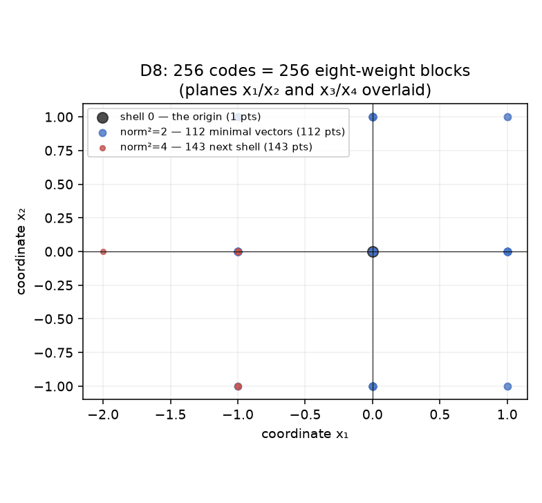
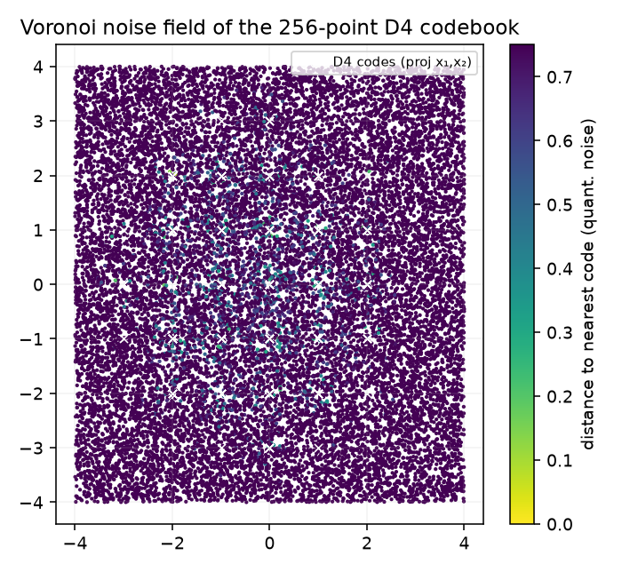
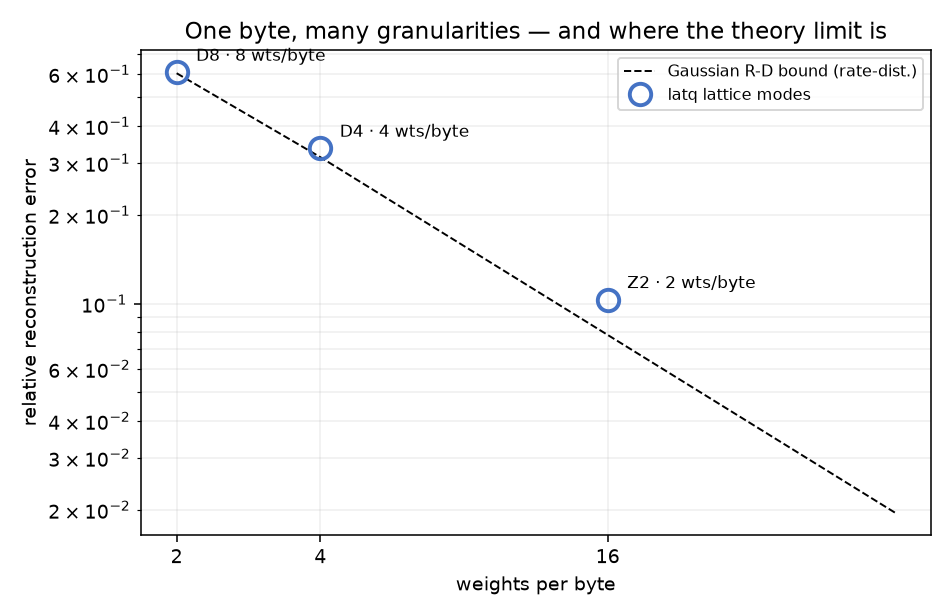

# latq — quantization notes: what 8 weights per byte actually costs


A worked derivation, with code. The question: I want ~1 bit per weight. Scalar
quantizers say that's unusable. Lattice quantizers say it's *provably within
0.7% of optimal*. I believe the lattices because I can measure them — that's
what this package is.

## The rate–distortion fact that sets everything up

A Gaussian source quantized at `R` bits/sample can't beat distortion
`D ≥ 2^(−2R)` (relative to its variance). At 1 bit/weight that's
`sqrt(1 − 2/π) ≈ 0.602` — the **entropy of the format, not of any algorithm**.
So the design question isn't "can my quantizer beat 0.602?" (it can't), it's
"how close can a codebook I can actually fit in L1 get?"

latq's answer: close enough to be *indistinguishable from the bound*:

| mode | weights/byte | measured rel. err | bound | on the floor? |
|---|---|---|---|---|
| **D8** | **8** | **0.6072** | **0.6028** | **+0.7%** |
| D4 | 4 | 0.3355 | 0.3133 | +7% |
| Z2 | 2 | 0.1037 | 0.0783 | +33% |

The test suite *asserts* this: `test_d8_at_rate_distortion_floor` fails if D8
drifts 5% above the bound (and — just as important — if it lands **below** it,
which would mean a format leak). Codebooks are deterministic and tested for
their invariants.

## The codebook, drawn

D8's 256 codes plotted by shell, and D4's Voronoi noise field — these aren't
clip-art, `demos/make_figures.py` projects the actual `build_codebook()`
output:

 

One byte indexes one of 256 eight-coordinate lattice points; every code is an
even-sum integer vector (tested), and the 3σ-to-radius scale policy
(`scale = 3·σ_row / R_codebook`) was picked by sweep, not superstition.



## Decode side

A byte-index gather from a 256×dim fp32 table — 2–8 KB, so the *whole
codebook lives in L1/shared while the byte stream runs past it*. The Triton
GEMV does exactly that; kernel vs reference max abs error is printed by the
demo (`~1e-6` per mode) and asserted in tests.

## Versus the published quantizers

| | bits/weight | needs | what this repo is for |
|---|---|---|---|
| GPTQ/AWQ INT4 | ~4.15 | calibration set, per-group scales | baseline; see `bithash` for the scale-policy question |
| AQLM | 1–4 | multi-stage codebook training | the *advanced* answer; latq is the one-lattice answer |
| **latq** | 1, 2, 4 | **one `argmin` + one gather** | floor-attainment at 1 bpw, measurable in tests |

## Install / reproduce

```bash
pip install -e ".[dev]" && pytest -q        # 8 tests, incl. the floor pin
python demos/demo.py && python demos/make_figures.py
```

## Limits, stated as plainly as the claims

- The floor claims assume Gaussian rows — true for trained weights to first
  order; outliers break any 1-bpw scheme (that's what the D4 row is for).
- Z2 is honest INT4 territory (4.0 bpw): its win over grids is the scale
  mechanism, not exotic geometry.
- Nearest-lattice search here is brute-force 256-point argmin (fine offline;
  a GPU quantizer would do otherwise).

*Prior art in the literature: Conway–Sloane on sphere packings; AQLM (arXiv
2401.06118); QTIP (arXiv 2406.11235). No repos are cited here because the
formulas don't care who types them first.*
