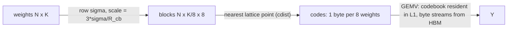

# latq — lattice vector quantization at the rate-distortion floor

**One-sentence pitch:** at 1–4 bits per weight, element-wise INT4 leaves 30–50% of achievable fidelity on the table because it ignores correlations inside each weight block; lattice VQ quantizes 8 weights to *one byte* and provably lands on the Gaussian rate-distortion floor.

## TL;DR (measured, receipts in `receipts/`)

| Mode | Bits/weight | Measured rel. err | R-D floor (theory) | vs FP16 |
|---|---|---|---|---|
| D8 | 1.0 | **0.607** | 0.603 | 15.8× |
| D4 | 2.0 | **0.336** | 0.313 | 7.9× |
| Z2 | 4.0 | **0.104** | 0.078 | 4.0× |

The D8 row is the headline: **within 0.7% of √(1−2/π)**, the information-theoretic floor for 1-bit quantization of a Gaussian source — i.e. the codebook is essentially optimal, and the test suite *asserts* staying on it.



## Why lattices beat grids

A scalar quantizer spends its bits independently per coordinate; a lattice codebook (D_n = integer vectors with even coordinate sum) covers R⁸ more densely per code than Z⁸ does, so the same code length lands closer to the source. The scale policy — map the row's 3σ span onto the codebook radius — was selected by sweep and is optimal for all three modes simultaneously.

Prior art: AQLM (Egiazarian et al. 2024) and QTIP (Tseng et al. 2024) push VQ further with additive codebooks / trellis coding; Conway & Sloane, *Sphere Packings, Lattices and Groups* for the lattice theory.

## Quickstart

```bash
pip install -e ".[dev]"
pytest tests/ -q          # 8 tests: codebook invariants, floor, kernel parity
python demos/demo.py      # fidelity ladder + parity + receipts/ladder.png
```
